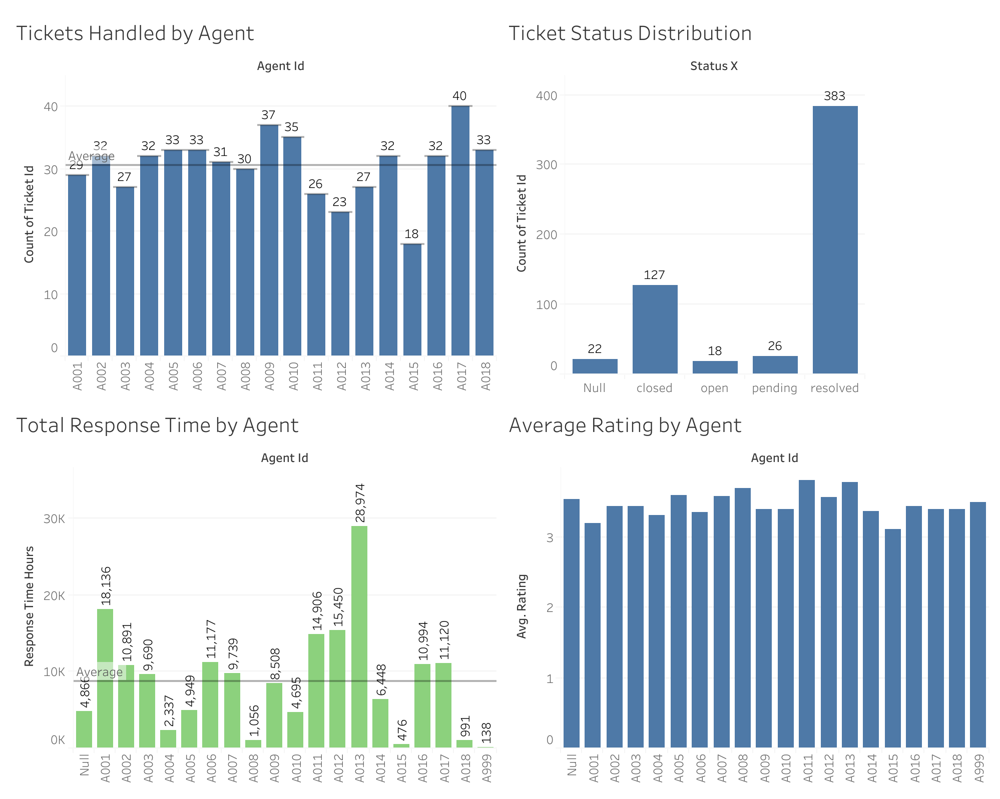

# Customer Support Analytics Project

## Overview

This project analyzes customer support operations using simulated support datasets containing:
- support tickets
- customer reviews
- agent information

The goal of the analysis was to identify operational inefficiencies, workload distribution patterns, response time issues, and customer satisfaction trends.

The project includes:
- data cleaning
- feature engineering
- exploratory data analysis (EDA)
- KPI analysis
- dashboard-style visualizations

---

# Tools & Technologies

- Python
- Pandas
- NumPy
- Matplotlib
- Seaborn

---

# Project Workflow

## 1. Data Cleaning

Several preprocessing steps were performed before analysis:

- handling missing values
- removing duplicates
- fixing inconsistent values
- correcting invalid timestamps
- standardizing text fields

## 2. Feature Engineering

| Feature | Description |
|---|---|
| `response_time_hours` | Calculated response time between ticket creation and resolution |
| `resolution_time_hours` | Total ticket resolution duration |
| `is_overloaded` | Indicates overloaded agents based on workload |
| `ticket_priority_group` | Grouped ticket priority categories |
| `rating_numeric` | Numerical customer review rating |

## 3. Exploratory Data Analysis

The analysis explored:
- response time trends
- ticket volume
- agent workload
- customer satisfaction
- review patterns
- support efficiency KPIs

### Key Insights

- Some agents handled significantly higher ticket volumes than others.
- Longer response times were associated with lower customer ratings.
- Certain ticket categories showed consistently slower resolution times.
- Customer satisfaction scores varied depending on workload and response speed.
- Ticket distribution was uneven across agents and support categories.

---

# Dashboard & Visualization Preview

## Support KPI & Agent Performance Analysis



The visual analysis focused on:
- response times
- workload distribution
- customer ratings
- ticket categories
- support performance KPIs

---

# Limitations

- The datasets were simulated for portfolio purposes.
- Some operational patterns may not fully represent real-world support environments.
- Customer satisfaction can be influenced by factors not included in the dataset.


# Author

Semyon Sidorov


---

# Project Structure

```text
Customer_Support_Analytics_Project/
│
├── data/
│   ├── raw/
│   └── processed/
│
├── notebooks/
│
├── images/
│
├── README.md
│
└── requirements.txt
